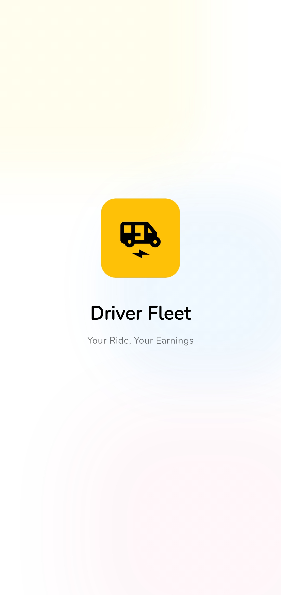
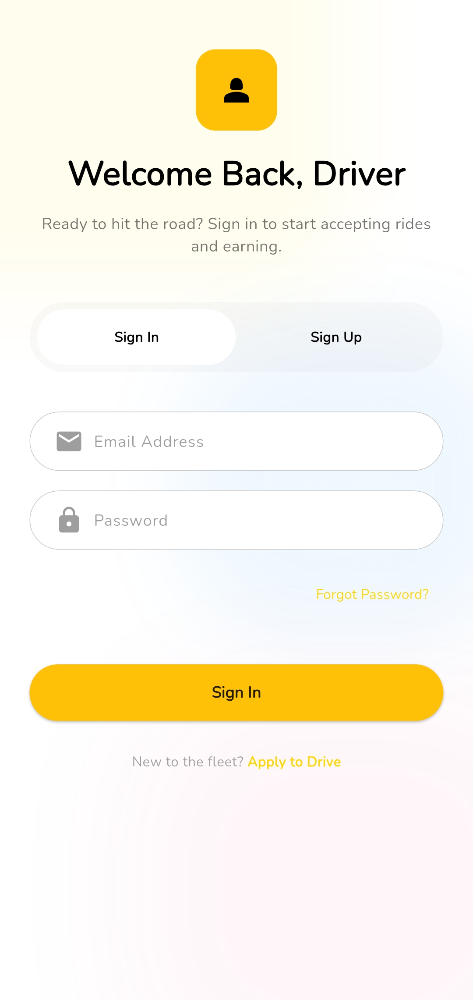
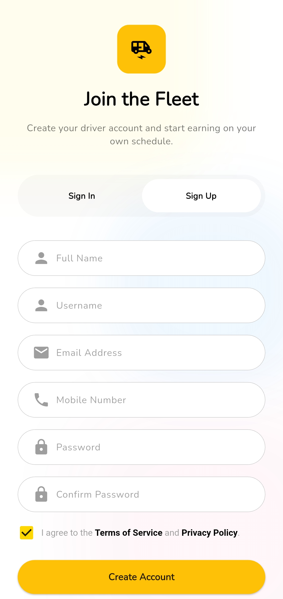
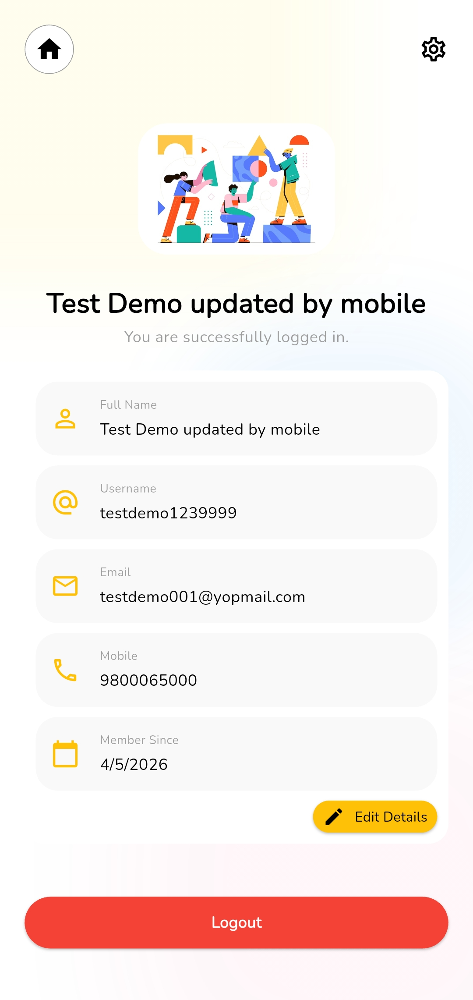
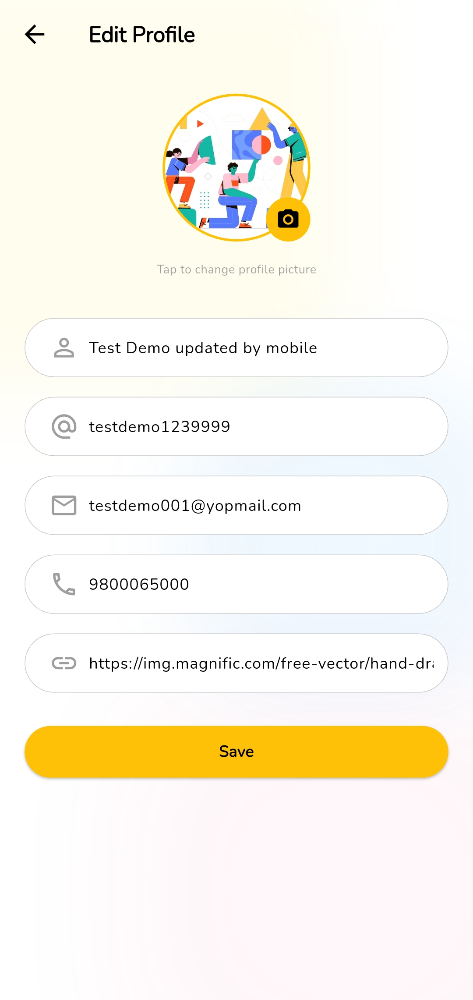

# 🚀 Full Stack Mobile App
### Flutter + Dart Frog + MongoDB

  
  
  
  

  <b>A complete full-stack mobile application with authentication, API integration, and modern architecture.</b>

---

## 📂 Project Structure

full-stack-app/

├── app_backend/     # Dart Frog backend (APIs + MongoDB)

├── app_frontend/    # Flutter mobile application

---

## 🧠 Overview

This project is built using:

- Flutter (Frontend)
- Dart Frog (Backend)
- MongoDB (Database)
- Render (Deployment)

---

## 🔥 Backend (app_backend)

Backend is built using Dart Frog with MongoDB.

### 🌐 Live API
https://full-stack-app-4vxu.onrender.com

### 📡 APIs

- GET `/`
- POST `/auth/register`
- POST `/auth/login`
- POST `/auth/logout`
- GET `/user/me`
- PUT `/user/update`

### 🔐 Authentication
- JWT-based authentication
- Secure password handling
- Token stored and verified

---

## 📱 Frontend (app_frontend)

Flutter mobile application with:

- BLoC state management
- API integration using HTTP
- Clean UI
- Authentication flow

---

## 📸 Screens

<table>
  <tr>
    <td align="center">
      <b>Splash Screen</b> 
      
    </td>
    <td align="center">
      <b>Sign In Screen</b> 
      
    </td>
    <td align="center">
      <b>Sign Up Screen</b> 
      
    </td>
  </tr>

  <tr>
    <td align="center">
      <b>Home Screen</b> 
      
    </td>
    <td align="center">
      <b>Profile Screen</b> 
      
    </td>
    <td></td>
  </tr>
</table>

---

## 🛠️ Tech Stack

Frontend:
- Flutter
- BLoC
- HTTP

Backend:
- Dart
- Dart Frog

Database:
- MongoDB

Deployment:
- Render

---

## 🚀 Run Project

### Clone Repo
git clone https://github.com/PHarshilLadila/full-stack-app.git
cd full-stack-app

### Run Backend
cd app_backend
dart pub get
dart run build/bin/server.dart

### Run Frontend
cd app_frontend
flutter pub get
flutter run

---

## 👨‍💻 Author

Harshil Gajipara
